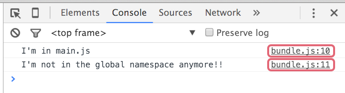
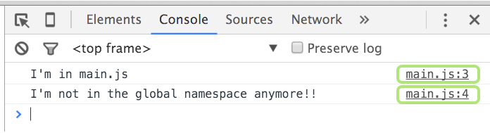

# Watchify
So far we are using the `gulp.watch` method to watch for changes in our JavaScript files and run the `scripts` task every time a change is detected. This task will recompile **all** of the dependencies into the `bundle.js` file. At this point this is ok, but as a project starts to grow, build times will grow as well. Wouldn't be nice if we could rebuild only the dependencies that have been modified?

[Watchify][1] is a [Browserify][2] plugin that watches our JavaScript files, when changes are detected it triggers an **incremental** build, meaning our bundle is rebuild with only the changes made to the dependencies that have been modified. This way we can keep our build times under control. To install it, **locally** as usual:
```
$ npm i watchify -D
```

Now we can add it to the `scripts` section of our `package.json` file:
```json
...
"scripts": {
  "start": "gulp",
  "watch": "watchify src/main.js -o dist/public/js/bundle.js"
},
...
```

So we can use it from the command line running:
```
$ npm run watch
```

## Using Watchify in our gulpfile
Once **Watchify** has been installed we have to require it at the top of our `gulpfile.js`:
```js
...
var watchify    = require('watchify');
...
```

And modify some tasks a bit:

1. Let's start by getting rid of the `gulp.watch` method in our `'serve'` task, and while we're at it, add a couple of settings to the server (Browsersync):
```js
gulp.task('serve', function() {
  browserSync.init({
    open: false,           // Don't touch my browser dude
    logFileChanges: false, // Don't be so chatty
    server: {
      baseDir: "./dist"
    }
  });
});
```

2. Check what we've done with the `'scripts'` task:

  1. First we have declared a `bundler` variable, which will hold the Browserify instance returned by the call to `browserify`:
  ```js
  var bundler = browserify({
    entries: ['src/js/main.js'],
    cache: {},
    packageCache: {},
    plugin: [watchify]
  });
  ```
  Here we're passing several configuration options for **Browserify**, including `watchify` in the `plugin` property. Also, according to the [watchify documentation][3], when creating the browserify instance (`bundler`), you MUST set the `cache` and `packageCache` properties, it doesn't matter if they're empty objects.

  2. Next we can configure the `watchify` plugin passing our settings as an object:
  ```js
  bundler.plugin(watchify, {
    delay: 100,
    ignoreWatch: ['**/node_modules/**'],
    poll: false
  });
  ```

  3. After that we create the function that will be called on each build:
  ```js
  function bundle () {
    return bundler
      .bundle() // This is a Browserify method.
      .on('error', function (err) {
        gutil.log(gutil.colors.red('Browserify error:'), err.message);
      })
      .pipe(source('bundle.js')) // Creates in-memory vinyl file object.
      .pipe(gulp.dest('dist/public/js')) // Written to dist/public/js/bundle.js
      .pipe(browserSync.stream()); // Reload browser when bundle.js is written
  }
  ```

  4. Finally we are doing two things:
  ```js
  bundle(); // We have to call bundle() to get `update' events.
  bundler.on('update', bundle);
  bundler.on('log', function (e) {
    gutil.log(gutil.colors.green('Browserified!'), e); // Output build logs to terminal
  });
  ```

  Also according to the [Watchify docs][3], Watchify will not emit `'update'` events until you've called `bundle()` once and completely drained the stream it returns.

  Then we've adding an event listener on `bundler`, which listens for the `update` event, emitted by Watchify when changes to a **dependency** have been saved. We use this event to trigger a call to the `bundle` function.

  Finally, we're listening for another Watchify event (`'log'`), which fires after a bundle has been created with messages of the form:

    777 bytes written (0.01 seconds)

## Source maps
This `gulpfile` file works fine but it's missing something important. All the JavaScript source code that our application uses is contained inside the `bundle.js` file. If we open our browser's **developer tools** and check the console, we can see that the location of each of the `console.log` statements inside the `bundle.js` file:



If we double click on the link to the right we are taken to the source code of `bundle.js`.This file contains our original source code, and a bunch of other code added by **Browserify** to make the whole thing work. If case we have to debug this code in the browser console, the **errors** that the console shows us will refer to lines in the `bundle.js`. It would be nice if the browser gave us the errors and warnings with references to the files where we wrote our source code and the respective lines inside these files. As it happens that's possible using a technology called **source maps**.

> A **source map** is auxiliary content that map the lines of code in the generated bundle back to the original lines in the respective files that we authored.

Browserify has available the `--debug` option to generate an inline source map, which is included inside the `bundle.js`. Let's add this option in our `gulpfile.js`:

```js
var bundler = browserify({
  ...
  debug: true // Generate inline source maps
});
```

If we restart the server, the new build will contain the source map included in the last line as a comment. It looks like this:
```js
//# sourceMappingURL=data:application/json;charset=utf-8;base64,eyJ2Z....
```

It starts with the `sourceMappingURL` prefix, followed by a [data URI scheme][4]. The data is encoded in [base64][5]. Now if we check our browser, we can see how the `console.log` statements show us their location in the original files we authored:




### External source maps
One of the inconveniences of having the maps included in our bundle is the increased size of the file. Luckily, there are several choices to have our source maps generated in separate files:

* [Exorcist][6]
* [gulp-sourcemaps][7]

We're gonna use the second one. And we're gonna be needing an additional package named [vinyl-buffer][8]. To install them we'll run:
```
$ npm i vinyl-buffer gulp-sourcemaps -D
```

Then we'll require them at the top of our gulpfile:
```js
...
var buffer      = require('vinyl-buffer');
var sourcemaps = require('gulp-sourcemaps');
...
```

#### About vinyl objects
You may be wondering why do we need that additional package (`'vinyl-buffer'`). We mentioned at the beginning that **Gulp** works with **vinil objects** and that **Browserify** generates regular [Node.js streams][9] that have to be converted to vinyl objects so Gulp can work with them (that's why we installed the [vinyl-source-stream][10] at the beginning.

> Vinyl is a **virtual file format** used by Gulp. Read more about it [here][11]

Well, that's not the end of the story. As it happens, the content of a vinyl object can take 3 forms:

* Empty
* Buffer
* Stream

Some gulp plugins (gulp-sourcemaps is among them) take in **buffered** vinyl file objects as input, but `vinyl-source-stream` emits a **streaming** vinyl file object. So we need to convert the streaming vinyl object produced by `vinyl-source-stream` to a buffered vinyl object so it can be used by `gulp-uglify` and a bunch of other plugins. The [vinyl-buffer][8] package does that, so we have to plug it in after `source` and before we use `sourcemaps`.

#### Modifying the 'scripts' task
Now we just have to add the following lines to our `'scripts'` task:
```js
...
.pipe(source('bundle.js')) // Creates in-memory vinyl-stream.
.pipe(buffer()) // Converts vinyl-stream to vinyl-buffer.
.pipe(sourcemaps.init({loadMaps: true})) // Loads existing map from Browserify.
.pipe(sourcemaps.write('../maps')) // Write the maps to the ../maps directory.
.pipe(gulp.dest('dist/public/js'))
...
```

Now, if we start the server our build process will output a `bundle.js.map` file to the `map/` folder, and everything should work the same in our browser.


> Check out the [watchify branch][12] to see the state of the project at this stage.

---
[:arrow_backward:][back] ║ [:house:][home] ║ [:arrow_forward:][next]

<!-- navigation -->
[home]: ../README.md
[back]: browserify.md
[next]: #


<!-- links -->
[1]: https://github.com/substack/watchify
[2]: http://browserify.org/
[3]: https://github.com/substack/watchify#watchifyb-opts
[4]: https://en.wikipedia.org/wiki/Data_URI_scheme
[5]: https://en.wikipedia.org/wiki/Base64
[6]: https://www.npmjs.com/package/exorcist
[7]: https://www.npmjs.com/package/gulp-sourcemaps
[8]: https://www.npmjs.com/package/vinyl-buffer
[9]: https://nodejs.org/api/stream.html
[10]: https://www.npmjs.com/package/vinyl-source-stream
[11]: https://github.com/gulpjs/vinyl
[12]: https://github.com/lifeBalance/playground-js/tree/watchify
